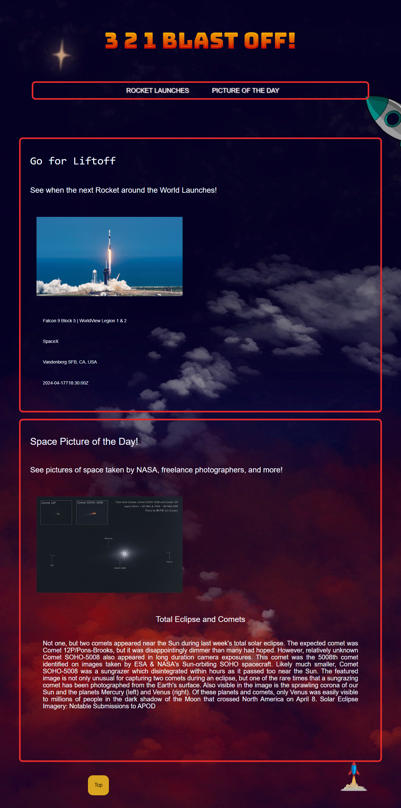

# 3 2 1 Blast Off!
A rocket launch tracker that provides information on the next rocket to launch, such as the association the rocket is under, and the name of the rocket. This application also utilizes the APOD Api to supply a 'Photo of the Day' along with a description of the photo.

### Installation & Use
The application will run on any browser, but the page features a custom font from the google font store, which may not work on browsers other than chrome. It is a simple one page application, which features a navagation bar for quick jumping to the various sections. There is a button at the bottom of the screen which will autoscroll back to the top when clicked.

### Credits

Alyson Sanchez: CSS, HTML
Giovani Leguizamon: CSS, HTML, Java Script
Sara Tibbs: CSS, HTML
Patrick Gustafon: Java Script
Ethan Robertson: Java Script, HTML

Rocket Launch Tracker API: https://lldev.thespacedevs.com/2.2.0/launch/upcoming/
Space Picture of the Day API: https://api.nasa.gov/planetary/apod?api_key=b42EJNM4mHurfnOSldM0PPgzarPZgdean7wvURrJ
Button: https://www.javatpoint.com/
Moving Rocket: codepen.io
Custom Font: https://fonts.google.com/specimen/Bungee+Spice?coloronly=true